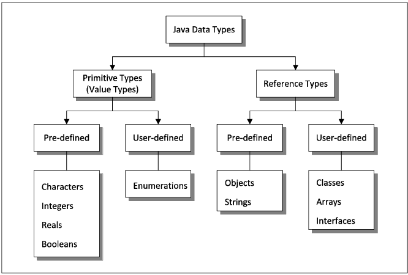
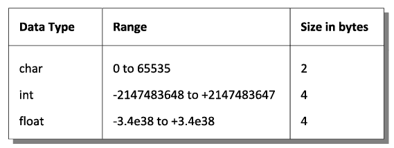

# Java Data Types and Variables

## Overview

Java, like any programming language, has four important aspects:
1. **Data Storage**: How data is stored in memory.
2. **Data Operations**: How operations are performed on the data.
3. **Input/Output**: How data is input and output.
4. **Control Flow**: How the sequence of instructions is controlled.

## Data Types in Java

Data types in Java are categorized based on where they are created in memory:

- **Primitive Types (Value Types)**: Created in the **stack**.
- **Reference Types (Non-Primitive Types)**: Created in the **heap**.

### Primitive Data Types
Primitive data types are further divided into:
- **Pre-defined**: Data types provided by Java (e.g., `int`, `char`, `float`, `double`).
- **User-defined**: Data types created by users (e.g., arrays, classes, objects, interfaces).

### Reference Data Types
Reference data types are also divided into:
- **Pre-defined**: Such as `String`.
- **User-defined**: Such as classes, interfaces, etc.



---

## Constants and Variables

### Constants
- A **constant** is a fixed value from the range of values offered by a data type.
- It is also called a **literal**.
- The value of a constant cannot change.

### Variables
- A **variable** is a container that can hold a value.
- It is also called an **identifier**.
- The value of a variable can change.



---

## Rules for Constructing Constants

1. If no sign precedes a numeric constant, it is assumed to be positive.
2. No commas or blanks are allowed within a constant.
3. The bytes occupied by each constant are fixed and do not change across compilers.
4. Only a `float` constant can contain a decimal point.
5. A `float` constant must be followed by a suffix `f`.
6. A `float` constant can be expressed in fractional form (e.g., `314.56f`) or exponential form (e.g., `3.1456e2`).
7. A character constant is a single alphabet, digit, or special symbol enclosed within single inverted commas (e.g., `'a'` is valid, but `'a'` is not).

---

## Rules for Constructing Variable Names

1. A variable name can consist of alphabets, digits, underscores (`_`), and dollar signs (`$`).
2. The first character must be an alphabet, underscore, or dollar sign.
3. No commas or blanks are allowed within a variable name.
4. Variable names are case-sensitive (e.g., `abc`, `ABC`, `Abc` are treated as different variables).

### Variable Naming Conventions
1. Variable names usually begin with an alphabet (e.g., `speed`, `average`).
2. Variables representing money often begin with `$` (e.g., `$interest`, `$salary`).
3. For multi-word variable names:
   - Use underscores (e.g., `current_speed`).
   - Use camel-case notation (e.g., `currentSpeed`).

It is good practice to use meaningful variable names. For example, use `prin`, `roi`, `noy` for Principal, Rate of Interest, and Number of Years instead of `a`, `b`, `c`.

---

## Java Keywords

Keywords are reserved words whose meaning is already known to the Java compiler. For example:

Here is a list of some common Java keywords:

- `int`
- `char`
- `float`
- `double`
- `boolean`
- `if`
- `else`
- `for`
- `while`
- `do`
- `switch`
- `case`
- `break`
- `continue`
- `return`
- `class`
- `public`
- `private`
- `protected`
- `static`
- `void`
- `new`
- `this`
- `super`
- `extends`
- `implements`
- `interface`
- `abstract`
- `final`
- `try`
- `catch`
- `finally`
- `throw`
- `throws`
- `package`
- `import`

These keywords cannot be used as variable names or identifiers in Java programs.

---

## Summary

- Java has **primitive types** (stored in the stack) and **reference types** (stored in the heap).
- **Constants** are fixed values, while **variables** can hold changing values.
- Follow specific rules for constructing constants and variable names.
- Use meaningful variable names for better code readability.
- Java keywords are reserved and cannot be used as variable names.

By understanding these concepts, you can write efficient and readable Java programs.

---

# Data Types Revisited

So far, we have used only `int` to deal with integer values and `float` to deal with real values. However, Java provides many flavors of integers and reals. Let us begin with integers.

---

## Integer Types

Java provides 4 types of integers: `byte`, `short`, `int`, and `long` of sizes **1 byte**, **2 bytes**, **4 bytes**, and **8 bytes** respectively.

| Data Type | Size  | Range                          |
|-----------|-------|--------------------------------|
| `byte`    | 1 byte| -128 to 127                   |
| `short`   | 2 bytes| -32,768 to 32,767             |
| `int`     | 4 bytes| -2,147,483,648 to 2,147,483,647|
| `long`    | 8 bytes| -9,223,372,036,854,775,808 to 9,223,372,036,854,775,807|

---

### Finer Points of Integer Types

1. **Default Type**:
   - By default, a number without a decimal point is treated as an `int`.
   - If the value being assigned exceeds the range of the variable, an error occurs. For example:
     ```java
     byte a = 300;       // error
     short b = 40000;    // error
     int c = 2200000000; // error
     ```

2. **Long Integer**:
   - To treat an integer as a `long`, add a suffix `L` or `l` at its end. For example:
     ```java
     long a = 365L * 1000;
     ```

3. **Underscores for Readability**:
   - Use underscores between digits in a number to improve readability. For example:
     ```java
     long creditCardNo = 1211_5178_9212_4231L;
     ```
   - **Note**: You cannot use underscores at the beginning or end of a number, or prior to the suffix `L`.

---

## Real Types

Real numbers can be represented as `float` and `double`. The difference between them is the number of bytes occupied, their ranges, and their precision.

| Data Type | Size  | Range                          | Precision      |
|-----------|-------|--------------------------------|----------------|
| `float`   | 4 bytes| ±3.40282347E+38F              | 6-7 decimal digits |
| `double`  | 8 bytes| ±1.79769313486231570E+308     | 15 decimal digits |

---

### Finer Points of Real Types

1. **Default Type**:
   - By default, a number with a decimal point is treated as a `double`.
   - To treat it as a `float`, add a suffix `f` or `F`. For example:
     ```java
     float x = 3.5;    // error
     float y = 3.5f;   // correct
     double d = 3.5f;  // correct
     double e = 3.5;   // correct
     ```

2. **Double Suffix**:
   - To treat an integer number as a `double`, use the suffix `d` or `D`. For example:
     ```java
     double a = 3d;
     ```

3. **Underscores for Readability**:
   - Use underscores between digits in a number to improve readability. For example:
     ```java
     float pi = 3.14_28_57F;
     ```
   - **Note**: You cannot use underscores at the beginning or end of a number, prior to the suffix `F`, or adjacent to the decimal point.

4. **Exponential Notation**:
   - For very small or very large numbers, use exponential notation. For example:
     ```java
     float a = 0.0000341295f;  // normal notation
     double b = 3214.23221;    // normal notation
     float c = 3.41295e-5f;   // exponential notation
     double d = 3.21e3;        // exponential notation
     ```

5. **Precision Loss**:
   - A real number stored in `float` or `double` is stored in binary form. During conversion from decimal to binary, some precision may be lost.
   - For example, `5.375` and `5.375f` are not equal because `5.375` as a `double` is represented as a 64-bit binary number, while `5.375f` as a `float` is represented as a 32-bit binary number, resulting in some loss of precision.

---

## Summary

- **Integer Types**: `byte`, `short`, `int`, `long`
- **Real Types**: `float`, `double`
- Use suffixes (`L`, `f`, `d`) to specify the type explicitly.
- Use underscores (`_`) to improve readability in large numbers.
- Be cautious about precision loss when working with `float` and `double`.


# `char` Data Type

A `char` data type represents a character expressed in **Unicode format**. The Unicode format has slowly replaced its predecessor, **ASCII format**. Characters in most of the known written languages used in the world can be represented using Unicode format.

In addition to the normal form, a character constant can also be specified using Unicode representation. This is shown below:

```java
char ch = 'X';    // character literal
char dh = '\u0058';   // Unicode
```
# `boolean` Data Type

The `boolean` data type can take Boolean values, `true` and `false`. A variable of the type `boolean` can either be assigned a Boolean value or an expression that evaluates to a Boolean value. This is shown below:

```java
boolean a = false;
System.out.println("a = " + a);  // Output: a = false

boolean b = 4 > 2;
System.out.println("b = " + b);  // Output: b = true