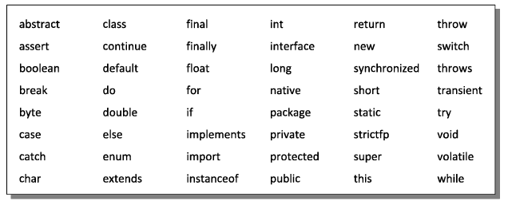

# Java Data Types and Variables

## Overview

Java, like any programming language, has four important aspects:
1. **Data Storage**: How data is stored in memory.
2. **Data Operations**: How operations are performed on the data.
3. **Input/Output**: How data is input and output.
4. **Control Flow**: How the sequence of instructions is controlled.

## Data Types in Java

Data types in Java are categorized based on where they are created in memory:

- **Primitive Types (Value Types)**: Created in the **stack**.
- **Reference Types (Non-Primitive Types)**: Created in the **heap**.

### Primitive Data Types
Primitive data types are further divided into:
- **Pre-defined**: Data types provided by Java (e.g., `int`, `char`, `float`, `double`).
- **User-defined**: Data types created by users (e.g., arrays, classes, objects, interfaces).

### Reference Data Types
Reference data types are also divided into:
- **Pre-defined**: Such as `String`.
- **User-defined**: Such as classes, interfaces, etc.

---

## Constants and Variables

### Constants
- A **constant** is a fixed value from the range of values offered by a data type.
- It is also called a **literal**.
- The value of a constant cannot change.

### Variables
- A **variable** is a container that can hold a value.
- It is also called an **identifier**.
- The value of a variable can change.

---

## Rules for Constructing Constants

1. If no sign precedes a numeric constant, it is assumed to be positive.
2. No commas or blanks are allowed within a constant.
3. The bytes occupied by each constant are fixed and do not change across compilers.
4. Only a `float` constant can contain a decimal point.
5. A `float` constant must be followed by a suffix `f`.
6. A `float` constant can be expressed in fractional form (e.g., `314.56f`) or exponential form (e.g., `3.1456e2`).
7. A character constant is a single alphabet, digit, or special symbol enclosed within single inverted commas (e.g., `'a'` is valid, but `'a'` is not).

---

## Rules for Constructing Variable Names

1. A variable name can consist of alphabets, digits, underscores (`_`), and dollar signs (`$`).
2. The first character must be an alphabet, underscore, or dollar sign.
3. No commas or blanks are allowed within a variable name.
4. Variable names are case-sensitive (e.g., `abc`, `ABC`, `Abc` are treated as different variables).

### Variable Naming Conventions
1. Variable names usually begin with an alphabet (e.g., `speed`, `average`).
2. Variables representing money often begin with `$` (e.g., `$interest`, `$salary`).
3. For multi-word variable names:
   - Use underscores (e.g., `current_speed`).
   - Use camel-case notation (e.g., `currentSpeed`).

It is good practice to use meaningful variable names. For example, use `prin`, `roi`, `noy` for Principal, Rate of Interest, and Number of Years instead of `a`, `b`, `c`.

---

## Java Keywords

Keywords are reserved words whose meaning is already known to the Java compiler. For example:

Here is a list of some common Java keywords:

- `int`
- `char`
- `float`
- `double`
- `boolean`
- `if`
- `else`
- `for`
- `while`
- `do`
- `switch`
- `case`
- `break`
- `continue`
- `return`
- `class`
- `public`
- `private`
- `protected`
- `static`
- `void`
- `new`
- `this`
- `super`
- `extends`
- `implements`
- `interface`
- `abstract`
- `final`
- `try`
- `catch`
- `finally`
- `throw`
- `throws`
- `package`
- `import`

These keywords cannot be used as variable names or identifiers in Java programs.

---

## Summary

- Java has **primitive types** (stored in the stack) and **reference types** (stored in the heap).
- **Constants** are fixed values, while **variables** can hold changing values.
- Follow specific rules for constructing constants and variable names.
- Use meaningful variable names for better code readability.
- Java keywords are reserved and cannot be used as variable names.

By understanding these concepts, you can write efficient and readable Java programs.

---

  
  
